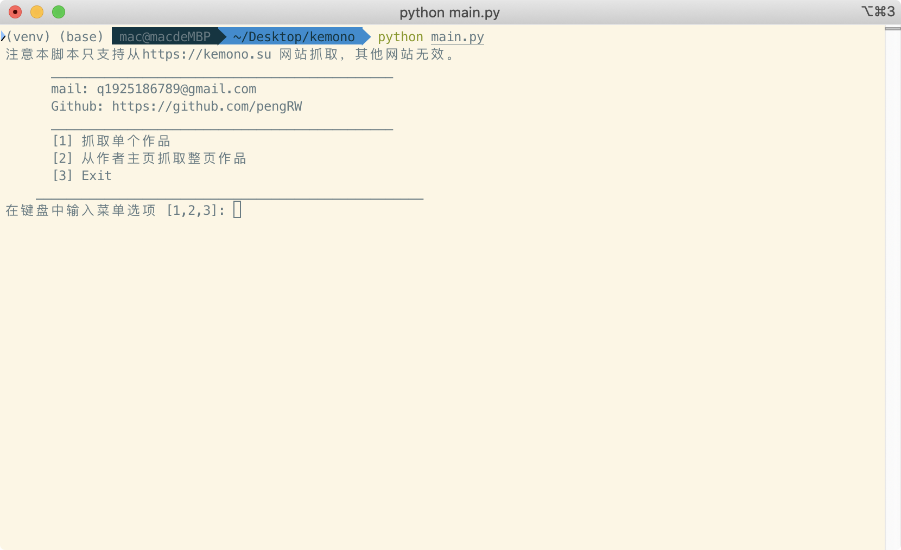

 # kemono 下载工具
简单的实现了下对 kemono.su 的抓取 使用简单

## 如何使用
1.  安装 python 3 (最好大于3.7以上)
2.  下载或者clone最新版本的源代码
3.  在项目根目录 安装依赖 `pip install -r requirements.txt`
4.  运行 `python main.py `

## 效果图

## License

MIT